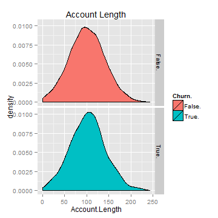

Churn Analysis
========================================================

One of the more common tasks in Business Analytics is to try and understand consumer behaviour. By understanding the hope is that a company can better change this behaviour. In many industries it is more expensive to find a new customer then to entice an existing one to stay. This is usually known as "churn" analysis.

### Data Set

This data is taken from a telecommunications company and involves customer data for a collection of customers who either stayed with the company or left wihtin a certain period. <i>In many industries its often not the case that the cut off is so binary. Frequently it might be more likely that a client account lays dormant rather then getting explicitly closed - for example if the client only pays for usage. I will explain how to adjust for these situations latter in the piece.</i> This dataset is taken from [here] (http://www.dataminingconsultant.com/data/churn.txt) with descriptions of the data available [here] (http://www.sgi.com/tech/mlc/db/churn.names). This dataset also appears in the [C50 package] (http://cran.r-project.org/web/packages/C50/index.html)

Lets load the required packages:


```r
library(plyr)
library(dplyr)
library(stringr)
library(ggplot2)
library(reshape2)
library(caret)
```

Next up we need to split the data. The Caret package makes this easy.


```r
#churn <- read.csv("D:/Users/soates/Downloads/churn.txt", header=T)
churn <- read.csv("E:/Github Stuff/srepho.github.io/churn.txt", header=T)
set.seed(12)
trainIndex <- caret::createDataPartition(churn$Churn., p = .5, list = FALSE, times = 1)
churnTrain <- churn[ trainIndex,]
churnTest <- churn[-trainIndex, ]
```
The first step is to have a look at the data - in particular we are initially interested in missing data, and any unusual clumping of variables.


```r
summary(churnTrain)
```

```
##      State      Account.Length    Area.Code        Phone      Int.l.Plan
##  WV     :  49   Min.   :  1.0   Min.   :408   327-3587:   1   no :1498  
##  MN     :  45   1st Qu.: 73.0   1st Qu.:415   327-3850:   1   yes: 169  
##  OH     :  44   Median :100.0   Median :415   327-3954:   1             
##  NC     :  43   Mean   : 99.4   Mean   :438   327-5817:   1             
##  WY     :  43   3rd Qu.:126.0   3rd Qu.:510   327-6087:   1             
##  UT     :  41   Max.   :232.0   Max.   :510   327-6194:   1             
##  (Other):1402                                 (Other) :1661             
##  VMail.Plan VMail.Message      Day.Mins       Day.Calls     Day.Charge   
##  no :1199   Min.   : 0.00   Min.   :  2.6   Min.   : 35   Min.   : 0.44  
##  yes: 468   1st Qu.: 0.00   1st Qu.:142.3   1st Qu.: 87   1st Qu.:24.19  
##             Median : 0.00   Median :178.4   Median :101   Median :30.33  
##             Mean   : 8.36   Mean   :178.7   Mean   :100   Mean   :30.38  
##             3rd Qu.:20.00   3rd Qu.:216.2   3rd Qu.:114   3rd Qu.:36.74  
##             Max.   :51.00   Max.   :350.8   Max.   :160   Max.   :59.64  
##                                                                          
##     Eve.Mins     Eve.Calls       Eve.Charge     Night.Mins   
##  Min.   :  0   Min.   :  0.0   Min.   : 0.0   Min.   : 47.4  
##  1st Qu.:166   1st Qu.: 87.0   1st Qu.:14.1   1st Qu.:167.6  
##  Median :201   Median :100.0   Median :17.1   Median :200.4  
##  Mean   :200   Mean   : 99.8   Mean   :17.0   Mean   :200.3  
##  3rd Qu.:234   3rd Qu.:113.0   3rd Qu.:19.9   3rd Qu.:233.9  
##  Max.   :352   Max.   :170.0   Max.   :29.9   Max.   :354.9  
##                                                              
##   Night.Calls     Night.Charge     Intl.Mins      Intl.Calls   
##  Min.   : 36.0   Min.   : 2.13   Min.   : 0.0   Min.   : 0.00  
##  1st Qu.: 86.0   1st Qu.: 7.54   1st Qu.: 8.4   1st Qu.: 3.00  
##  Median :100.0   Median : 9.02   Median :10.2   Median : 4.00  
##  Mean   : 99.7   Mean   : 9.02   Mean   :10.2   Mean   : 4.44  
##  3rd Qu.:113.0   3rd Qu.:10.53   3rd Qu.:12.0   3rd Qu.: 6.00  
##  Max.   :166.0   Max.   :15.97   Max.   :20.0   Max.   :19.00  
##                                                                
##   Intl.Charge   CustServ.Calls    Churn.    
##  Min.   :0.00   Min.   :0.00   False.:1425  
##  1st Qu.:2.27   1st Qu.:1.00   True. : 242  
##  Median :2.75   Median :1.00                
##  Mean   :2.76   Mean   :1.52                
##  3rd Qu.:3.24   3rd Qu.:2.00                
##  Max.   :5.40   Max.   :9.00                
## 
```

We can see that there are no missing data in this set (something that almost never happens in real life!). There is a big skew in terms of the number of Churned to non-Churned (only ~17% of people churn so even guessing all as non-Churned would return a success rate of about ~83%!). We can also see some features that are being treated as numerical that should not be (for example Area.Code is treated as a numerical factor when it should be a categorical factor as the numbers are not related to each other). The other factor that stands out is that Phone Field is not really usable as it currently stands as it seems that each phone number is singular. We will put this to one side to see if we can modify it to extract something more meaningful.

So lets switch the Phone Field to a categorical factor.


```r
churnTrain$Area.Code<-as.factor(churnTrain$Area.Code)
churnTest$Area.Code<-as.factor(churnTest$Area.Code)
```

The next step is to have a close look at the variables graphically.


```r
one<-ggplot(churn, aes(x=Account.Length, fill=Churn.))+geom_density()+ facet_grid(Churn. ~ .) + labs(title="Account Length")
two<-ggplot(churn, aes(x=VMail.Message, fill=Churn.))+geom_density()+ facet_grid(Churn. ~ .) + labs(title="Voice Mails")
one 
two
```

  


<script>
  (function(i,s,o,g,r,a,m){i['GoogleAnalyticsObject']=r;i[r]=i[r]||function(){
  (i[r].q=i[r].q||[]).push(arguments)},i[r].l=1*new Date();a=s.createElement(o),
  m=s.getElementsByTagName(o)[0];a.async=1;a.src=g;m.parentNode.insertBefore(a,m)
  })(window,document,'script','//www.google-analytics.com/analytics.js','ga');

  ga('create', 'UA-52218028-1', 'srepho.github.io');
  ga('send', 'pageview');

</script>

